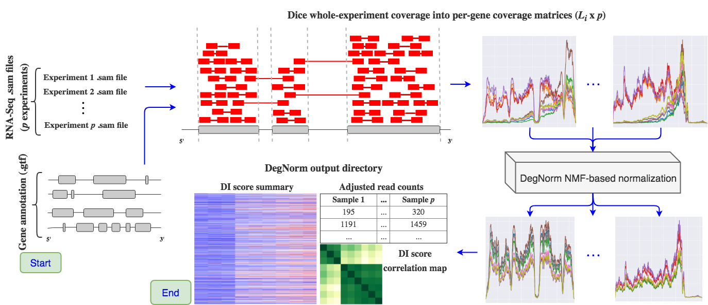

===========================================================
DegNorm: Normalizing RNA degradation in RNA-Seq experiments
===========================================================

.. image:: https://travis-ci.org/ffineis/DegNorm.svg?branch=master
    :target: https://travis-ci.org/ffineis/DegNorm

RNA-Seq transcriptome sequencing experiments often undergo gene- *and* sample-specific transcript degradation, thus
potentially biasing results in standard RNA-Seq analysis (e.g. differential expression analysis). The DegNorm pipeline
uses non-negative matrix factorization with an over-approximation constraint to normalized degraded gene transcript
coverage curves.

Users supply ``.sam`` files from paired-read RNA-seq experiments and a genome annotation file, and the DegNorm
pipeline will generate everything from coverage matrices, normalized coverage matrices, plots, and a report.

==============
Pipeline steps
==============

1. **Read RNA-Seq .sam files** and **compute chromosome coverage** for each experiment. Currently, only paired reads are considered. DegNorm does not use standard coverage tools (e.g. ``geneomecov``) that do not take into account paired read overlap when computing coverage - here, every *match* segment of a read's CIGAR score augments nucleotide coverage. For each experiment, for each chromosome, we save coverage in a compressed Numpy array. There are ``p`` experiments.

2. **Parse a genome annotation file** (.gtf or .gff). DegNorm determines the relative start and end positions of each gene transcript and each exon found to comprise the gene on each chromosome. Genes occurring on multiple chromosomes and exons occurring on multiple genes are removed. In total, DegNorm will map ``n`` genes.

3. **Assess gene read counts** from coverage curves - count the number of unique paired reads falling entirely within the start and end position of every gene. The read counts matrix is ``n x p`` (2-d array).

4. **Break up chromosome coverage matrices into gene coverage matrices**. Matrices are saved to pickle file (a serialized data format for Python), one per chromosome.

5. **Fit a non-negative matrix factorization with over-approximation** model, as outlined in the central DegNorm paper.

6. **Save** adjusted read counts, gene- and experiment-specific *degradation index scores*, normalized coverage matrices, and coverage visualizations to an output directory.

======================================
DegNorm pipeline output file structure
======================================

.. code-block:: text

    DegNorm_<mmddYY_HHMMSS> (pipeline output directory)
        |
        |-- read_counts.csv: genes x samples matrix of raw sample read counts.
        |-- adjusted_read_counts.csv: genes x samples matrix of DI-score adjusted read counts.
        |-- degradation_index_scores.csv: genes x samples matrix of per-gene, per-sample DI scores.
        |-- gene_exon_metadata.csv: gene and constituent exon positioning data on each chromosome. The order of the genes in this file dictates the genes (rows) in both of the read count matrices and the DI score matrix.
        |
        |-- [<chromosome name> directory]
        | |-- coverage_matrices_<chromosome name>.pkl: serialized dictionary of {gene: coverage matrix} data.
        | |-- estimated_coverage_matrices_<chromosome name>.pkl: serialized dictionary of {gene: estimated coverage matrix} data.
        | |-- <gene ID>_coverage.pngs: gene-specific plots of pre- and post-DegNorm coverage curves, for genes specified with ``--genes`` flag.
        |
        |-- [report]
        | |-- degnorm_summary.html
        | |-- <supporting images>

===================
Usage: the pipeline
===================
The primary entry point into the DegNorm software is the ``degnorm`` console script.

``degnorm`` flags and details are outlined with the ``--help`` flag.

Required input
##############

1. Pass at least 2 ``.sam`` files (or ``.bam`` files, if you have ``samtools`` installed) with the ``-i/--input`` flag, or the location of a directory containing at least 2 .sam or .bam files with the ``--input-dir`` flag. The ``--input-dir`` flag must contain all files of either .sam or .bam extension. If a mix of .sam and .bam files are found in the input directory, only the .sam files will be consumed.

2. Pass a genome annotation file (.gtf/.gff) describing where each gene falls on a chromosome with the ``-g/--genome-annotation`` flag.

An example DegNorm pipeline run using the .sam files found in the directory ``../sam_files`` that will
plot the coverage curves for all genes in ``../plot_genes.txt``:

.. code-block:: bash

    $ degnorm --input-dir ../sam_files -g ../genes.gtf -o ./degnorm_output --plot-genes ../plot_genes.txt -c 6

``--warm-start-dir``
####################
The DegNorm preprocessing (steps 1. through 4.) is heavy, and time consuming. Should you want to run DegNorm with
the same input files but with a a different parameterization, there is no need to recompute gene coverage matrices.
Simply use the ``--warm-start-dir`` flag to specify the output directory of a prior DegNorm run, and the pipeline
will copy and load the previously-determined coverage matrices, original read counts, and parsed exon/gene annotation
data for your new run.

==========================================
Usage: accessing data after a pipeline run
==========================================

``get_coverage_plots``
######################

Should you need coverage plots in addition to the ones generated during a DegNorm pipeline run, ``get_coverage_plots``
leverages the coverage matrices (original and degradation index-normalized) saved in a DegNorm output directory to
make new plots.

.. code-block:: python

    from degnorm.data_access import get_coverage_plots

    # pass one or many gene names to obtain one or many coverage plots
    plots = get_coverage_plots(['SDF4', 'TMEM229B'], degnorm_dir='./DegNorm_09022018_214247')
    plots[0].show()

If you would simply like every gene's coverage plot, set ``genes='all'``. Most pipeline runs involve 1000s of genes, so rendering a plot for each gene will likely take a bit of time.

You can also save the resulting plots by specifying a ``save_dir`` argument to the path of a directory where you want to save the plots.
Each gene is saved in a chromosome-level directory:

.. code-block:: python

    out = get_coverage_plots('all', degnorm_dir='./DegNorm_09022018_214247', save_dir='FFvsFFPE_plots')

``get_coverage_data``
#####################

Should you need the raw or estimated coverage matrices computed during a DegNorm pipeline run, ``get_coverage_data`` is here to help.
It loads the .pkl files saved in the output directories. This function operates similarly to ``get_gene_coverage``, only that
the returned value is a dictionary with gene name keys and values are sub-dictionaries with a `raw` and `estimate`
pandas.DataFrames, the raw and DegNorm-estimated coverage data, respectively.

.. code-block:: python

    from degnorm.data_access import get_coverage_data

    # pass one or many gene names, load up coverage matrix dictionary
    cov_dat = get_coverage_data('TMEM229B', degnorm_dir='./DegNorm_09022018_214247')

    # save gene coverage data to .txt file
    cov_dat = get_coverage_data('TMEM229B', degnorm_dir='./DegNorm_09022018_214247', save_dir='FFvsFFPE_data')

=======
Testing
=======
Check the successful installation of ``degnorm`` on your machine with the ``degnorm_test`` command. This runs all unit tests
and a minimal DegNorm pipeline run on a small batch of sample data.

By default, ``degnorm_test`` will clean up after itself by removing the temporary directory containing the output
of a full pipeline test run. If you would like to keep and inspect that directory, add the ``--keep-output`` flag:

.. code-block:: bash

    $ degnorm_test --keep-output

============
Installation
============

THIS PACKAGE NOT YET ON PYPI.

**Install manually in Conda environment:**

1. ``git clone`` this repository and ``cd`` into it.

2. Create a degnorm Conda environment (accept default libraries) and activate it:

.. code-block:: bash

    $ conda create -n degnorm python=3.6
    $ source activate degnorm

3. Run the install script:

.. code-block:: bash

    $ ./install
