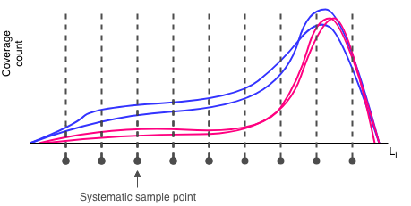
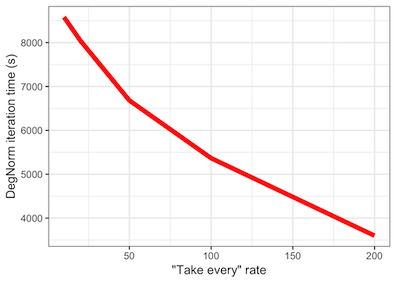
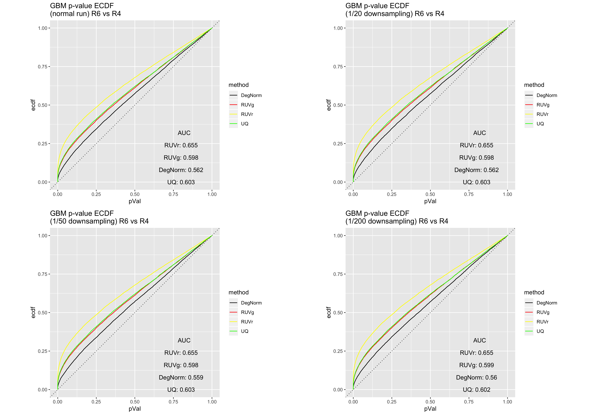
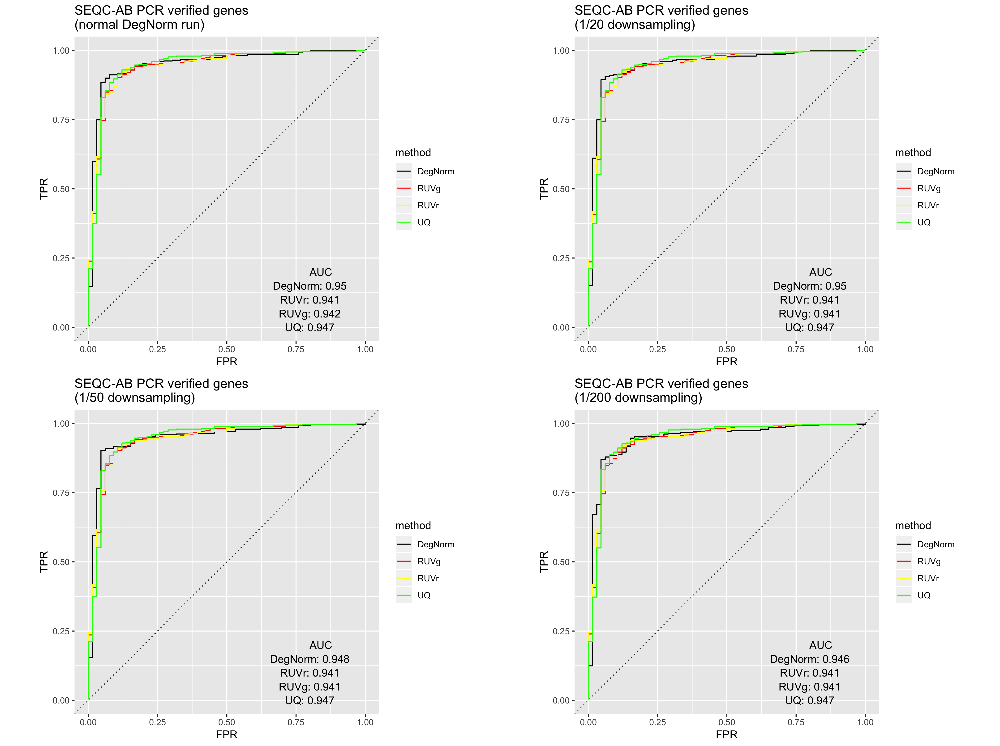
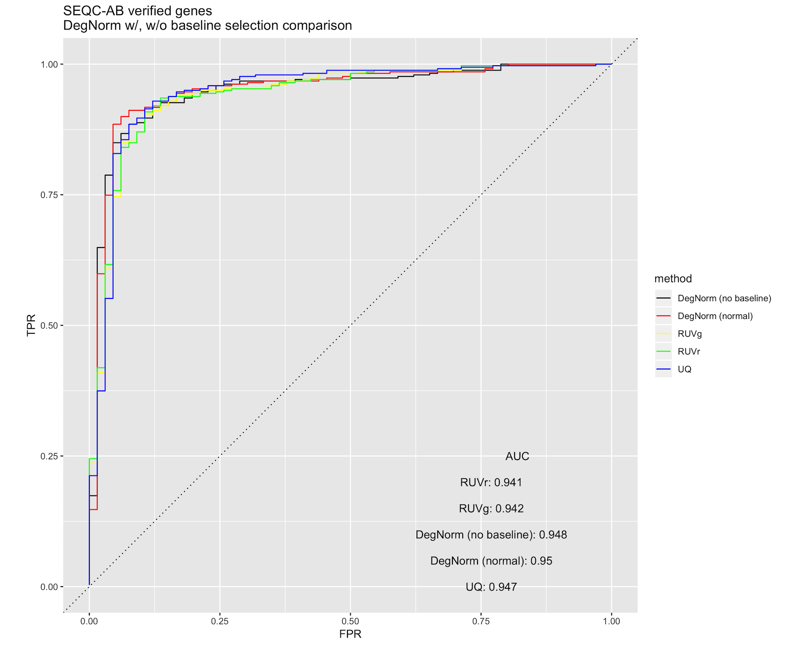
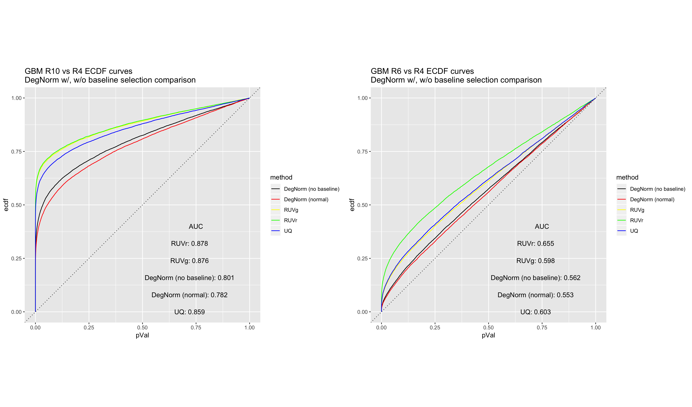

# DegNorm speed enhancements

## Downsampling coverage matrices
The backbone of the DegNorm normalization pipeline is the non-negative matrix factorization with over-approximation (NMFOA) algorithm.
 NMFOA is a computationally expensive algorithm, requiring `--nmf-iter`-many singular value decompositions of the coverage matrix.
 The SVD is O(n^3) in terms of flop count (according to Trefethen and Bau), so genes with smaller coverage matrices will 
 naturally run through NMFOA faster than larger ones.
 
In an effort to trim down the coverage matrices, the `--downsample-rate` argument in `degnorm` allows you to use a [systematic sample](https://en.wikipedia.org/wiki/Systematic_sampling) 
for each gene's coverage matrix in lieu of the larger original ones. The `--downsample-rate` is just the integer-valued
"take-every" step size, so that the original coverage matrix is reduced by a factor of 1 / (downsample rate). At a modest
 downsampling rate, the overall shape of the coverage curves should still be recognizable.
 

Obviously, the higher the downsampling rate, the faster the DegNorm iterations will complete, because DegNorm
executes SVD approximations on smaller and smaller gene coverage matrices. The figure below illustrates the time savings
at various downsampling rates from the 9-sample gliablastoma (GBM) cell line study data set:

### Impact

We recreated the DE analysis using the GBM data as well as
the Sequencing Quality Control (SEQC) AA vs. AB data at various downsampling rates.
In comparison to the non-downsampled results (as in, 1/1 downsampling), we see that moderate downsampling - e.g. a rate of 1/20 - 
does not substantially impact DE analysis and still allow for DegNorm retains its edge over existing RNA-Seq normalization methods, while
offering 50%+ DegNorm iteration time savings.

**GBM RIN 10 vs. RIN 4 ECDF curve comparison**

**GBM RIN 6 vs. RIN 4 ECDF curve comparison**

**SEQC AA vs AB ROC curve comparison**

To run DegNorm with downsampling, add `-d <take every>` (full option `--downsample-rate <take every>`) where
 `take every` is the integer step size for the systematic sample. Note that genes with total concatenated exon length
 less than the downsample rate will not be included in the DegNorm pipeline.

## Skipping baseline selection
The most expensive part of the DegNorm normalization algorithm is in finding a "baseline" region of non-degraded coverage
across all samples, a process referred to as **baseline selection**. In the event that that region is small, the approximation of a single gene's coverage curves may require
over a thousand SVDs.

**Skipping baseline selection offers the largest speedup**, more than any level of downsampling,
but likely with a more heavy impact on DegNorm's performance. We cannot wholly endorse skipping baseline selection,
but for those who are seeking *ballpark* DegNorm results in an hour or two, this option may be for you.

### Impact

The impact of skipping baseline selection is experiment-specific, and is likely
due to the nature and extent of RNA degradation present in the samples. As is shown in the figure below,
the skipping baseline selection negatively impacts the SEQC AA/AB DE ROC curve.

At the same time, DegNorm still retains its
advantage over the existing normalization methods with respect to GBM p-value ECDF curves, even while skipping baseline selection.
 

Run DegNorm without baseline selection at your own risk by adding the `--skip-baseline-selection` flag at the command line.

## v.0.1.1 MPI release
The next `degnorm` release will feature an MPI implementation for cross-node .bam file processing.
Further, individual DegNorm iterations will be distributed, as the per-gene NMF-OA approximation
algorithm is embarrassingly parallel. Stay tuned!
