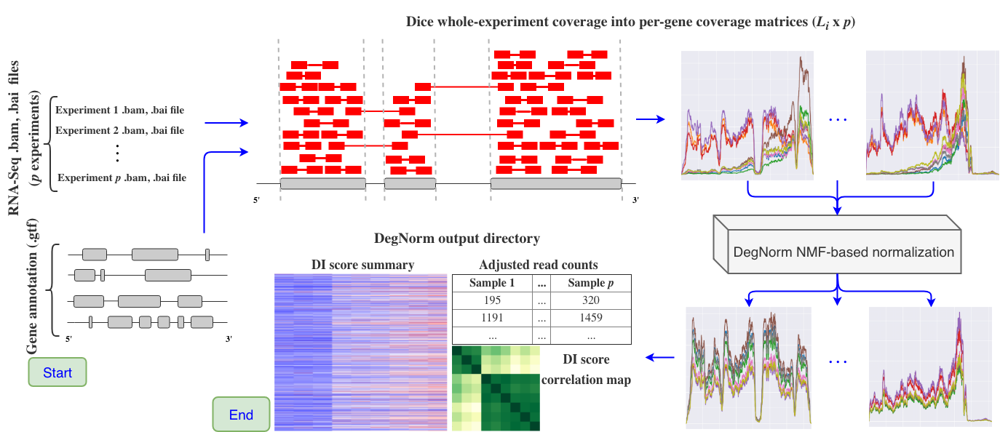

# DegNorm Home

DegNorm source code on [GitHub](https://github.com/NUStatBioinfo/DegNorm)

## What is DegNorm?

DegNorm, short for **deg**radation **norm**alization, is a bioinformatics pipeline designed to 
correct for bias due to the heterogeneous patterns of transcript degradation in RNA-seq data. DegNorm helps improve the accuracy of the differential expression analysis by accounting for this degradation.

In practice, RNA samples are often more-or-less degraded, and the degradation severity is not only sample-specific, but gene-specific as well. It is known that longer genes tend to degrade faster than shorter ones. 
As such, commonplace global degradation normalization approaches that impose a single normalization factor on all genes within a sample can be ineffective in correcting for RNA degradation bias.

DegNorm is a data-driven approach for RNA-Seq normalization resulting in the adjusted read count matrix. This adjustment applies to each gene within each sample, accounting for sample- and gene-specific degradation bias while simultaneously controlling for the sequencing depth.
The algorithm at the center of DegNorm is the rank-one over-approximation of a gene's coverage score matrix, which is comprised
of the different samples' coverage score curves along the transcript for each gene.
For each gene, DegNorm estimates (1) an envelope function representing the ideal shape of the gene's coverage curve when no degradation is present, and (2) scale factors for each sample (for said gene) that indicates the relative abundance of the gene within the sample.

Define a (gene, sample) **degradation index score** (DI score) as the area between the scaled envelope function and the actual coverage score function, divided by the area under the scaled envelope function, for each gene within each sample.
The DI score can be used to account for read count loss due to degradation.

## How does the pipeline work?

The DegNorm pipeline is comprised of the following steps

1. **Load in sorted .bam files**. DegNorm also requires bam index (.bai) files - these can be created for you if `samtools` is in your `$PATH`. DegNorm will determine whether the RNA-Seq experiment was obtained from a paired read or single read platform.

2. **Parse a genome annotation file** (.gtf or .gff). We determine the start and end positions of all exons comprising each gene in each chromosome. Each gene's total transcript is constructed by concatenating all annotated exons sequentially. Exons shared by multiple genes are removed from the total transcript. The total number of genes is referred to as `n`.

3. **Compute gene coverage matrices**. DegNorm does not use standard coverage tools (e.g. `geneomecov`), as they do not take into account the overlap of paired-end reads when computing coverage. DegNorm reads the CIGAR score and determines whether two paired reads overlap. The overlapped region is only counted once in the coverage score calculation. There are `p` experiments.

4. **Assess per-gene read counts** by counting the number of pairs of reads (in the paired data) or number of reads (single-end) falling entirely within the start and end position of every gene. The read count matrix has dimensions `(n, p)`.

5. **Fit a non-negative matrix factorization with over-approximation** model, as outlined in the central DegNorm paper.

6. **Save output data to an output directory that includes**
    - original read counts
    - degradation-adjusted read counts
    - gene-/sample-specific *degradation index scores* 
    - raw coverage matrices stored in .pkl files, one file per chromosome
    - normalized coverage matrices, also stored in .pkl files, one file per chromosome
    - DegNorm summary report